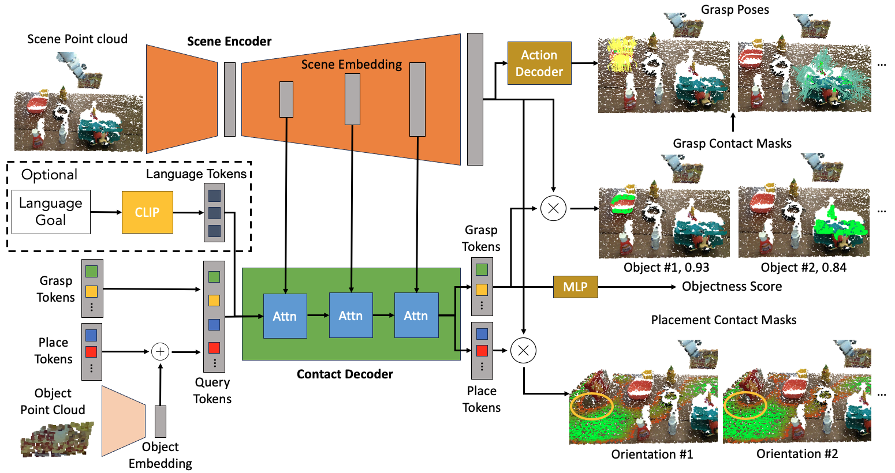
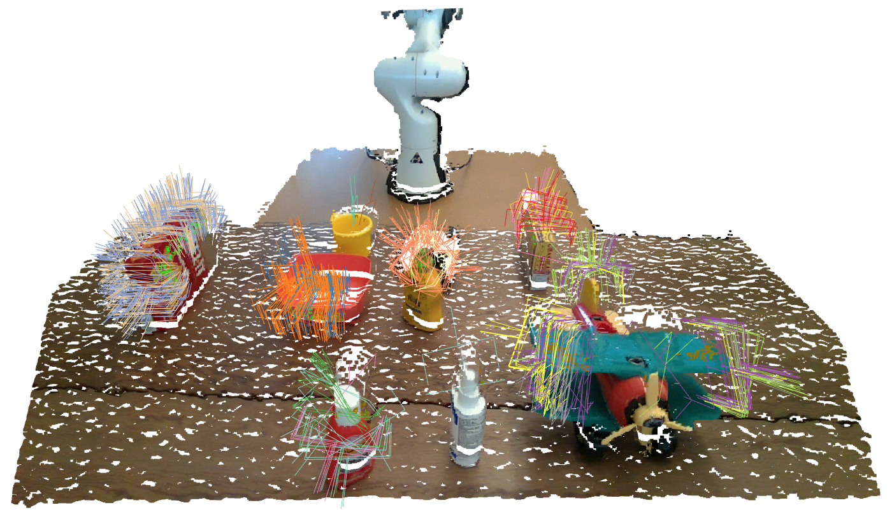

# M2T2: Multi-Task Masked Transformer for Object-centric Pick and Place
### [project website](https://m2-t2.github.io) &emsp; &emsp; [arxiv paper](https://arxiv.org/abs/2311.00926) &emsp; &emsp; [model weights](https://drive.google.com/drive/folders/1qlvHVi1-Jk4ET-NyHwnqZOxALVy9kTO5)


## Introduction
**M2T2** (**M**ulti-**T**ask **M**asked **T**ransformer) is a unified transformer model for learning different low-level action primitives on complex open-world scenes. Given a raw point cloud observation, M2T2 reasons about contact points and predicts collision-free gripper poses for different action modes, including 6-DoF object-centric grasping and orientation-aware placement. M2T2 achieves zero-shot sim2real transfer on the real robot, outperforming the baseline system with state-of-the-art task-specific models by about 19% in overall performance and 37.5% in challenging scenes where the object needs to be re-oriented for collision-free placement. M2T2 also achieves state-of-the-art results on a subset of language conditioned tasks in RLBench. This repository contains a basic PyTorch implementation of M2T2 and demo scripts for how to run the model on real-world as well as simulated scenes. Videos of real-world robot evaluations are available on our [project website](https://m2-t2.github.io).


M2T2 pairs a transformer with a 3D point cloud encoder-decoder to predict contact points and gripper targets for pick and place primitives in complex, cluttered environments. It can also be optionally conditioned on a language goal to predict task-specific grasp/placement poses.

If you find our work useful, please consider citing our paper:
```
@inproceedings{yuan2023m2t2,
  title     = {M2T2: Multi-Task Masked Transformer for Object-centric Pick and Place},
  author    = {Yuan, Wentao and Murali, Adithyavairavan and Mousavian, Arsalan and Fox, Dieter},
  booktitle = {7th Annual Conference on Robot Learning},
  year      = {2023}
}
```
## Installation
1. Create and activate conda environment
```bash
conda env create -n m2t2 python=3.10
conda activate m2t2
```
2. Install CUDA. Replace `11.7.0` with the CUDA version compatible with your nvidia driver. You can check your CUDA version using `nvidia-smi`.
```bash
conda install cuda -c nvidia/label/cuda-11.7.0
```
3. Install PyTorch which matches the cuda version. Check https://pytorch.org/get-started/previous-versions.
```bash
pip install torch==2.0.1 torchvision==0.15.2
```
4. Install PointNet++ custom ops.
```bash
pip install pointnet2_ops/
```
5. Install additional dependencies.
```bash
pip install -r requirements.txt
```
6. Install m2t2 as a package.
```bash
pip install .
```

## Running M2T2
1. Download [[model weights]](https://huggingface.co/wentao-yuan/m2t2). `m2t2.pth` is the generic pick-and-place model which outputs all possible grasping and placement poses, whereas `m2t2_language.pth` is a model that outputs a single grasping or placement pose conditioned on a language goal.

2. Run `meshcat-server` in a separate terminal. Open `http://127.0.0.1:7000/static/` in a browser window for visualization.

3. Try out M2T2 on different scenes under `sample_data`.
    1. `real_world/00` and `real_world/02` contain real-world scenes before grasping
    ```
    python demo.py eval.checkpoint=m2t2.pth eval.data_dir=sample_data/real_world/00 eval.mask_thresh=0.4 eval.num_runs=5
    ```
    Use `eval.mask_thresh` to control the confidence threshold for output grasps. Use `eval.num_runs` to aggregate multiple forward passes for more complete prediction.

    2. `real_world/00` and `real_world/02` contain real-world scenes before placement. It can be run with the same command. Just replace the path in `eval.data_dir`.

    3. Under `rlbench` there are two episodes of the task `meat_off_grill`. Running the following command to see the grasp prediction
    ```
    python demo_rlbench.py eval.checkpoint=m2t2_language.pth rlbench.episode=4
    ```
    and
    ```
    python demo_rlbench.py eval.checkpoint=m2t2_language.pth rlbench.episode=4 rlbench.frame_id=90
    ```
    to see the placement prediction.

Here are some example visualizations



## Training
We are not able to release the training dataset at this point due to copyright issues, but we do provide the training script and a few simulated scenes under `sample_data/simulation` to show the data format. Here's how you would train the model.
```
python train.py m2t2.action_decoder.max_num_pred=512 data.root_dir=sample_data/simulation train.log_dir=logs/test train.num_gpus=1 train.batch_size=4 train.print_freq=1 train.plot_freq=4
```
You can visualize training curves and plots by running tensorboard on the log directory:
```
tensorboard --logdir logs/test
```